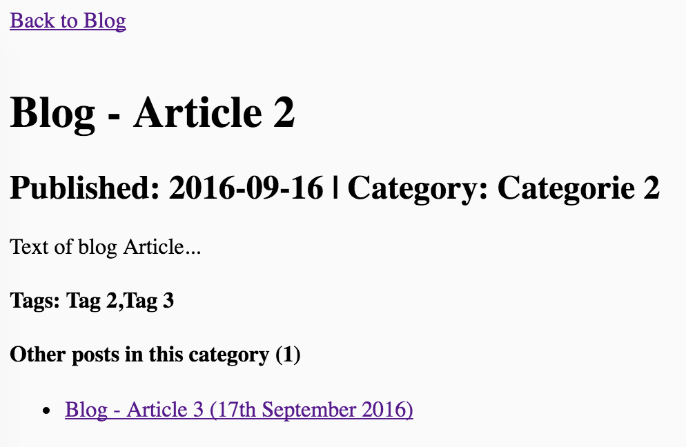

# yafbp - Blog Example #

Based on: [Yet another front-end build process](https://github.com/koljakutschera/yafbp "Yet another front-end build process") - V1.0.0

This is just a simple example project to demonstrate what you can built with yafbp.

In this example a very simple blog is build up from yafbp's template data layer.
The index-page simply links to the blog-page.
The blog-page uses a function from the global-data-object to generate linked-lists from all blog-articles by category and tags sorted by date.
The blog-article-page shows some meta-information etc. and other blog-articles in the same category by reusing the global function for generating linked-lists of pages by key-value.

Impressions:

Home:


Blog:


Blog-article:



## Documentation and Setup ##

Please see [Yet another front-end build process](https://github.com/koljakutschera/yafbp "Yet another front-end build process") for documentation and setup.

When the process is running see source/ directory to learn how it works.

## Additional dokumentation ##

This example also demonstates a fancy way to work with SVGs. Why: [Inline SVG vs Icon Fonts](https://css-tricks.com/icon-fonts-vs-svg/)

### SVG Images/Icons ###

To unlock the full potential of SVG, including full element-level CSS styling and evaluation of embedded JavaScript,
 the full SVG markup must be included directly in the DOM. In this example this is done by a fast, caching, dynamic inline-SVG DOM injection [library](https://github.com/iconic/SVGInjector "SVGInjector") that injects SVGs to img-tags as inline-code.

To inject an SVG just use an img-tag with data-inject="svg" and src="/path/to/svg" attributes.

> Hint: You can configure the SVG-injection in scripts/tools/injectSVGs.js

Example: Injecting an SVG

```html

```

Because browser-support for SVG starts with IE9 you can use data-fallback attribute to set a per-element PNG fallback for older Browsers.

Example: Injecting an SVG with png-fallback:

```html

```

### Scripting SVG Images ###

If you want to script/animate an SVG via javascript you have to wait for the "all-SVGs-injected"-Event on document.

Example: Log when all SVGs are injected with jQuery.

```javascript
$(document).on('all-SVGs-injected', function (event) {
    console.log('now you can script/animate the SVGs')
});
```

If you got dynamic views rendered by javascript you have to call window.injectSVGs in your script after the view is rendered to inject new SVGs. Already rendered SVGs are cached.

```javascript
window.injectSVGs();
```

See  [https://github.com/iconic/SVGInjector](https://github.com/iconic/SVGInjector) for more.


## Contribution ##

Please don't! Except for bugs. This is just an example.


## Thank you ##

Thank you to all funky developers listed in /package.json. Special thanks to Waybury for [SVGInjector](https://github.com/iconic/SVGInjector).


## Licence ##

The MIT License (MIT)

Copyright (c) 2016 [Kolja Kutschera](http://koljakutschera.de/ "Kolja Kutschera")

Permission is hereby granted, free of charge, to any person obtaining a copy
of this software and associated documentation files (the "Software"), to deal
in the Software without restriction, including without limitation the rights
to use, copy, modify, merge, publish, distribute, sublicense, and/or sell
copies of the Software, and to permit persons to whom the Software is
furnished to do so, subject to the following conditions:

The above copyright notice and this permission notice shall be included in
all copies or substantial portions of the Software.

THE SOFTWARE IS PROVIDED "AS IS", WITHOUT WARRANTY OF ANY KIND, EXPRESS OR
IMPLIED, INCLUDING BUT NOT LIMITED TO THE WARRANTIES OF MERCHANTABILITY,
FITNESS FOR A PARTICULAR PURPOSE AND NONINFRINGEMENT. IN NO EVENT SHALL THE
AUTHORS OR COPYRIGHT HOLDERS BE LIABLE FOR ANY CLAIM, DAMAGES OR OTHER
LIABILITY, WHETHER IN AN ACTION OF CONTRACT, TORT OR OTHERWISE, ARISING FROM,
OUT OF OR IN CONNECTION WITH THE SOFTWARE OR THE USE OR OTHER DEALINGS IN
THE SOFTWARE.